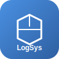

# LogSys CRM



**LogSys CRM** est un système complet de gestion de relation client (CRM) multi-entreprises avec modules de messagerie, réunions, logistique et comptabilité selon le plan OHADA.

## 🚀 Fonctionnalités

### 🌐 Fonctionnalités générales
- **Multi-entreprises** - Gestion de plusieurs entreprises sur une seule plateforme
- **Multi-utilisateurs** - Gestion fine des rôles et permissions
- **Messagerie intégrée** - Similaire à Gmail/Outlook
- **Visioconférence** - Réunions virtuelles type Teams/Zoom
- **Notifications temps réel** - Email, SMS et notifications in-app
- **Gestion documentaire** - Upload, OCR, preview de documents
- **Tableaux de bord** - KPIs et statistiques personnalisés

### 📦 Plans d'abonnement
| Plan | Utilisateurs | Prix | Modules |
|------|-------------|------|---------|
| **Basic** | 5 | Gratuit | Messagerie, Réunions, Notifications |
| **Pro** | 50 | 100$/utilisateur | + Module Logistique |
| **Enterprise** | 100+ | 150$/utilisateur | + Module Comptabilité OHADA |

### 🏢 Module Logistique
- Gestion d'entrepôts multi-sites
- Suivi des stocks en temps réel
- Traçabilité par lots et numéros de série
- Commandes fournisseurs
- Gestion des expéditions
- Alertes de stock bas

### 📊 Module Comptabilité OHADA
- Plan comptable OHADA complet
- Saisie d'écritures comptables
- Gestion des factures clients/fournisseurs
- Suivi des paiements
- États financiers (Bilan, Compte de résultat)
- Déclarations fiscales

### 👑 Administration
- **Administrateur Système**
  - Gestion des entreprises
  - Gestion des abonnements
  - Audit complet
  - Supervision des utilisateurs
  
- **Administrateur Entreprise**
  - Gestion des utilisateurs de l'entreprise
  - Attribution des rôles
  - Configuration de l'entreprise

## 🛠️ Technologies

### Backend
- Node.js 18+ avec Express
- PostgreSQL 15+
- Redis 7+
- Socket.IO pour le temps réel
- Bull pour les jobs queues
- JWT pour l'authentification

### Frontend
- React 18+
- Vite
- TailwindCSS
- Zustand (state management)
- React Query
- Socket.IO client
- Recharts pour les graphiques

### Infrastructure
- Docker & Docker Compose
- Nginx
- Let's Encrypt (SSL)

## 📦 Installation

### Prérequis
- Docker 20.10+
- Docker Compose 2.0+
- Node.js 18+ (pour développement)
- Yarn ou NPM

### Installation rapide avec Docker

```bash
# Cloner le repository
git clone https://github.com/g-tech/logsys-crm.git
cd logsys-crm

# Démarrer avec Docker Compose
docker-compose up -d

# Ou utiliser le script de démarrage
./start.sh        # Linux/Mac
.\start.ps1       # Windows PowerShell